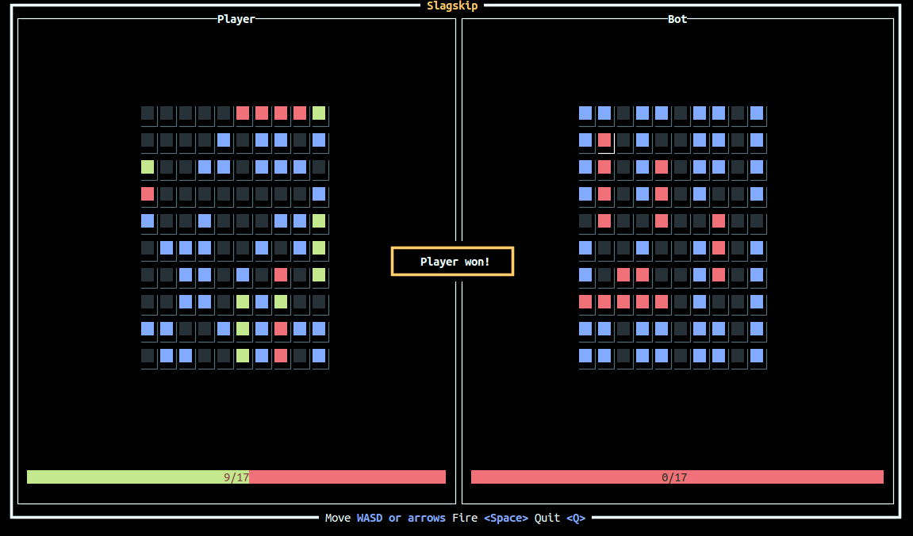

# Slagskip

Slagskip is an implementation of the Battleship board game.

The source code is available under an open source license, but contributions are
discouraged as this project is mostly for fun and to exercise my Rust skills.

## Terminal UI

Currently, the game has a terminal UI built using [Ratatui](https://ratatui.rs/)
that lets one player play against one computer.

Run `cargo run --release -- tui` to start the terminal UI.

